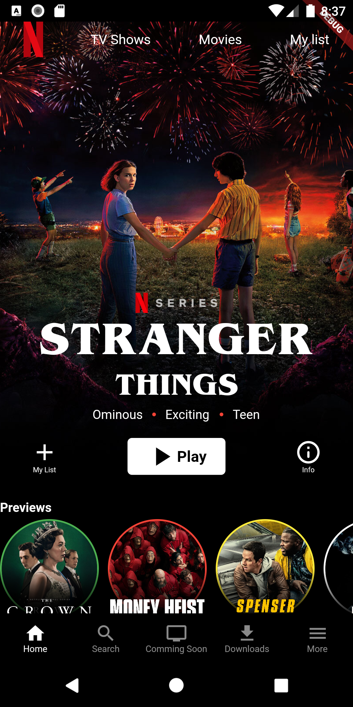
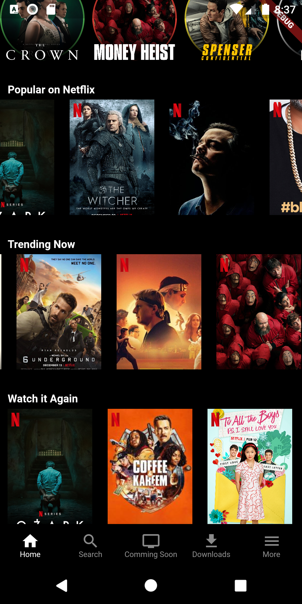
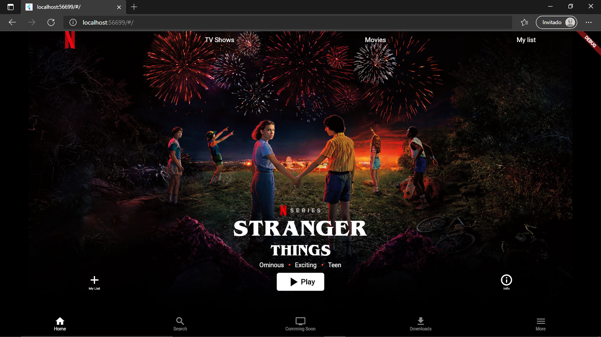
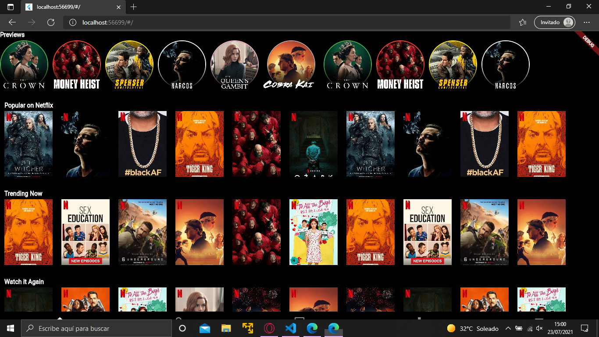
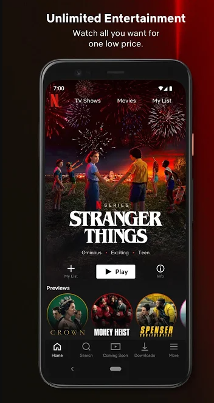
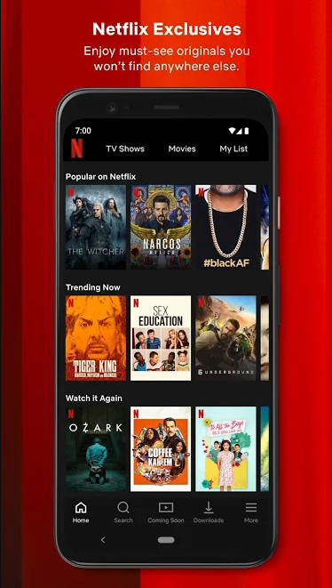

# Netflix Interface Clon

-> Flutter project to recreate the interface of the netflix home screen (also added integration with youtube)
 
-> Android emulator of Android Studio with Pixel 3 API 26
 
-> Edge (Web-javascript)
 
-> Flutter. 1.26.0-17.2 pre

## Results
### Android
  

 
### Web
  

 

## Side By Side Comparison
Left -> Original Play Store Screenshots
 
Right -> Clon App Screenshots
  

 

## Final Result
  

